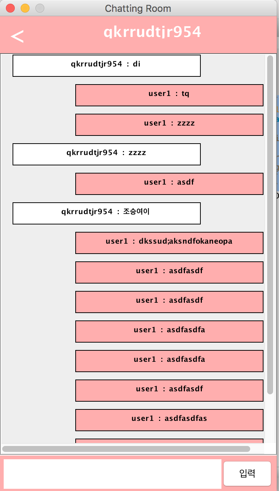

# Papao Talk

Simple Chatting App use Java Swing and MySQL


## Dev Environment

- Language : java 8
- DataBase : MySQL
- Framework : java swing
- Spring Structure
  - Spring MVC Pattern
- Design Pattern : Singleton Pattern, MVC Pattern(Model)


## How to Use

- 데이터 베이스에 유저를 추가한다.
  - add user into human table in database.
- 방을 생성한다.
  - add room using user_id and target_id
- 뷰에서 방을 클릭하고 대화를 할 수 있다.
  - click created room and finally can do Chatting!


## Data Base

- 유저 테이블을 생성한다.
- create human table.

```sql
CREATE TABLE `human` (
  `seq` int(11) NOT NULL AUTO_INCREMENT,
  `id` varchar(50) NOT NULL,
  `created_at` datetime DEFAULT NULL,
  PRIMARY KEY (`seq`),
  UNIQUE KEY `id` (`id`)
)
```

- 대화 테이블을 생성한다.
- create chat table.

```sql
CREATE TABLE `chat` (
  `seq` int(11) NOT NULL AUTO_INCREMENT,
  `room_id` int(11) DEFAULT NULL,
  `user_id` varchar(50) DEFAULT NULL,
  `content` varchar(2000) DEFAULT NULL,
  PRIMARY KEY (`seq`),
  KEY `fk_chat_user` (`user_id`),
  KEY `fk_chat_room` (`room_id`),
  CONSTRAINT `fk_chat_room` FOREIGN KEY (`room_id`) REFERENCES `room` (`seq`),
  CONSTRAINT `fk_chat_user` FOREIGN KEY (`user_id`) REFERENCES `human` (`id`)
)
```


- 채팅방 테이블을 생성한다.
- create chatting room table.

```sql
CREATE TABLE `room` (
  `seq` int(11) NOT NULL AUTO_INCREMENT,
  `user_id` varchar(50) DEFAULT NULL,
  `target_id` varchar(50) DEFAULT NULL,
  `last_modified` datetime DEFAULT CURRENT_TIMESTAMP,
  PRIMARY KEY (`seq`),
  KEY `fk_user` (`user_id`),
  KEY `fk_target` (`target_id`),
  CONSTRAINT `fk_target` FOREIGN KEY (`target_id`) REFERENCES `human` (`id`),
  CONSTRAINT `fk_user` FOREIGN KEY (`user_id`) REFERENCES `human` (`id`)
)
```

## Introduce Program

- Can conversation with other user.
- all conversation save into database table.
- can recognize my chat or other's chat.


## Demo

- chatting list

<br>


<br>
<br>


- Chatting

<br>




## Todo

- Add signin action and signup action.
